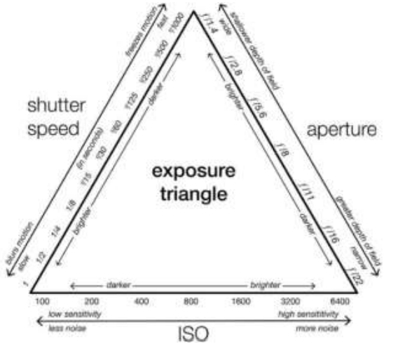
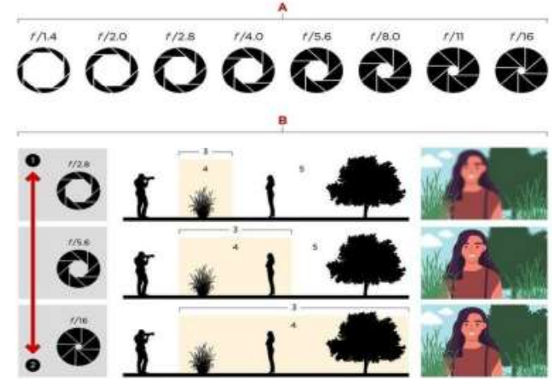
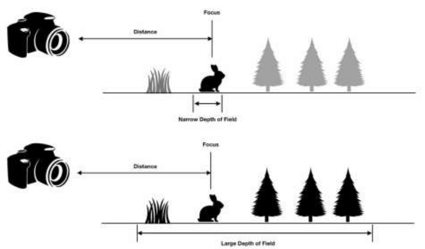
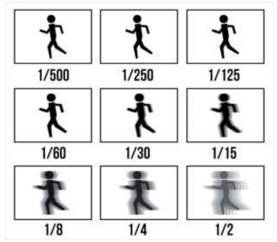
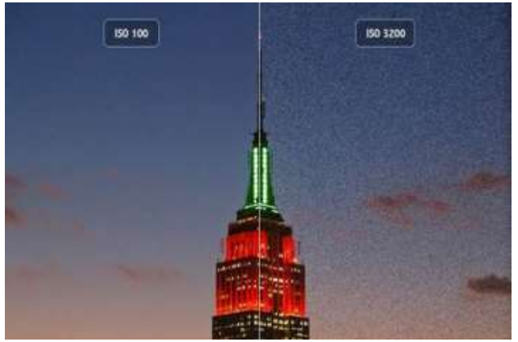

# **BAB 2**
## **DASAR PEMOTRETAN (EKSPOSURE)**
### **A. SEGITIGA EXPOSURE**

The Exposure Triangle atau Segitiga Exposure, merupakan sebutan yang mengarah
pada keseimbangan 3 unsur dasar pada Exposure, yaitu aperture, shutter speed dan ISO.
Ketiga Unsur ini saling berkaitan dalam proses masuknya paparan cahaya/sinar ke dalam
kamera sebelum mencapai sensor gambar, yang dimana proses ini disebut Exposure. Jika
terdapat perubahan yang terjadi pada salah satu unsur exposure, maka akan berpengaruh
pada perubahan elemen lainnya, sehingga ketiga unsur ini harus pada titik yang seimbang
agar menghasilkan gambar yang diinginkan.

#### *1. Aperture dan Depth of field*
   
*Aperture* merupakan istilah untuk menyatakan banyaknya cahaya yang tertangkap oleh
lensa. Hal ini merujuk pada seberapa besar bukaan yang memungkinkan cahaya masuk
dan diukur dalam Fstops. Fstop berlawanan dengan intuisi atau perhitungan normal
karena semakin besar angkanya maka semakin kecil bukaannya.

Contoh :

f/1.4 memungkinkan cahaya yang masuk dua kali lebih banyak dari f4 dan 16
kali lebih banyak dari f11.

Kedalaman bidang Kedalaman bidang merujuk pada fokus foto dan ini adalah
aspek yang wajib diperhatikan dengan seksama oleh fotografer terlebih jika ingin
menghasilkan foto yang bagus. Sebagai contoh, jika anda mengambil foto lanskap
sabana yang luas saat mendaki gunung, tentu anda ingin agar semua objek yang di foto
terlihat fokus tentunya. Oleh sebab itu untuk mengenal tentang kedalaman bidang foto
maka kita perlu mengetahui tentang Depth of Field.

*Depth of Field* atau Ruang Tajam adalah jarak antara benda terdekat dan terjauh
dalam sebuah foto yang nampak tajam. Sekarang ini, kamera yang ada hanya bisa fokus
secara tajam pada satu titik. Tapi transisi dari fokus secara tajam menjadi tidak tajam
terjadi secara bertahap, sehingga istilah ‘acceptably sharp (fokus yang sangat tajam)’
menjadi longgar.

Selain pemilihan kamera, DOF juga ditentukan oleh tiga faktor, yaitu aperture
atau bukaan lensa, panjang fokus lensa, dan jarak kamera dari objek foto. Melalui
pengaturan ketiga elemen tersebut, Fotografer bisa menghasilkan gambar dengan DOF
yang diinginkan.

Fungsi memahami DOF Dengan memahami dan mengaplikasikan efek ruang tajam
atau Depth of Field yaitu sebagai berikut

• Menciptakan kesan kedalaman pada foto yang bersifat dasar 2 dimensi

• Mengisolasi obyek dari background dan foreground sehingga obyek utama
foto menjadi lebih ter-expose dengan maksimal

#### *2. Shutter Speed*

Shutter Speed adalah kecepatan waktu aperture terbuka dalam menerima
cahaya yang masuk mengatur durasi bukaan jendela sensor ketika menerima paparan
cahaya sebelum menutup kembali. Semakin lama shutter speed terbuka, maka semakin
banyak intensitas cahaya masuk ke dalam film/sensor, sehingga menghasilkan foto lebih
terang. Shutter speed diukur dengan satuan ‘S’ atau second dan dinyatakan dalam 1/500,
1/250, 1/125, 1/60, 1/30, 1/15, 1/8, 1/4, 1/2. Semakin tinggi shutter speed kalian maka
semakin cepat jendela sensor membuka lalu menutup kembali, dan hasil gambar yang
dihasilkan akan lebih tajam.

Contoh :

Apabila mengambil foto air terjun dengan nilai shutter speed tinggi seperti 1/125,
sepermaka air terjun yang didapatkan akan seperti beku, karena jendela sensor
hanya membuka selama 0,125 detik untuk menangkap gambar objek bergerak pada foto.
Sebaliknya, kalau menggunakan shutter speed rendah, maka efek yang timbul adalah
gambar foto blur akibat kamera yang menangkap foto membutuhkan waktu beberapa
detik. Untuk kalian yang mau menggunakan shutter speed rendah maka sangat disarankan
untuk menggunakan tripod supaya hasil kamera tidak goyang dan blur.

##### **a. ISO / Sensitifitas**

ISO adalah tingkat sensitifitas sensor kamera terhadap cahaya. Semakin rendah
nilai ISO maka hasil foto akan semakin gelap, sebaliknya nilai ISO semakin tinggi
maka semakin terang foto yang dihasilkan. Namun apabila nilai ISO semakin tinggi
maka akan menghasilkan gambar yang banyak noise (bintik hitam) pada foto,
sedangkan semakin rendah nilai ISO maka akan semakin jernih foto tersebut. Sehingga
apabila mengambil gambar, diusahakan untuk mencari cahaya baik buatan ataupun
alami (cahaya matahari) untuk tetap mengusahakan nilai ISO yang digunakan tetap
rendah.
