# **BAB 3**
## **PENCAHAYAAN**

Pencahayaan dalam fotografi merupakan Unsur kunci yang memiliki dampak besar terhadap
hasil akhir suatu foto. Objek dapat tertangkap oleh lensa kamera karena terdapat cahaya yang
terima. Sebuah foto yang berhasil seringkali didorong oleh penanganan pencahayaan yang
cermat, yang dapat membedakan antara gambar yang memukau dan gambar yang kurang
menarik. Terdapat beberapa pencahayaan dalam dunia Fotografi yang tentunya setiap cahaya
memiliki fungsi dan perannya masing-masing.

### **A. Sumber Pencahayaan Fotografi**

#### **1. Pencahayaan Alami Atau Natural light**

Pencahayan Alami adalah jenis pencahayaan alam yang mana cahaya tersebut
dihasilkan secara alami dari alam dimana pencahayaan utama bersumber pada cahaya
matahari. Pencahayaan Alami digunakan untuk menampilkan cahaya yang lebih
natural. Adapun pencahayaan matahari memiliki jam-jam tertentu yang baik untuk
digunakan sebagai sumber cahaya dalam pemotretan yaitu pagi hari dan sore hari
hingga matahari terbenam. Hal ini dikarenakan pada jam-jam tersebut kekuatan sinar
matahari memiliki intensitas keterangan cahaya yang rendah, dan sudut
pencahayaannya pun merata sehingga cocok untuk melakukan pemotretan.

##### **a. Direct Light**

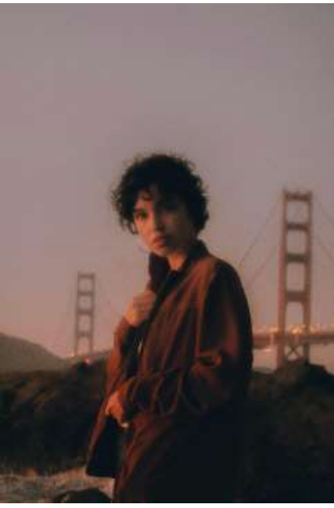

Direct Light merupakan pencahayaan pada objek dimana Cahaya matahari
langsung jatuh menimpa objek, berkas cahayanya kuat, terjadi kontras yang
mencolok antara bagian yang terkena sinar matahari dengan yang tidak terkena
sinar.

##### **b. Difused Light**

Difused Light merupakan pencahayaan pada objek pemotretan dimana cahaya
baur terjadi ketika sinar matahari tertutup awan, berkabut atau karena debu.
Dengan kata lain percampuran cahaya matahari dengan eleman alam lain yang
menghasilkan cahaya matahari lembut dan tidak terlalu keras atau soft light.

##### **c. Windows Light**

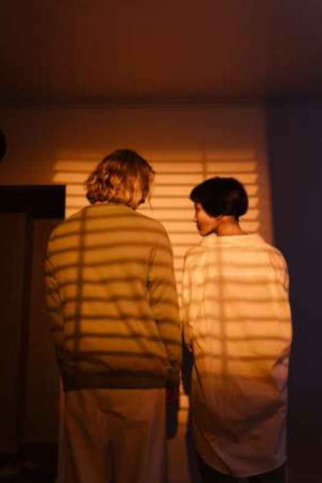

Windows Light Masuknya cahaya matahari ke dalam ruangan di pagi hari melalui
celah-celah jendela. Guratan jatuhnya cahaya sangat terlihat jelas, ini yang disebut
Windows Light. Ciri yang perlu diingat dalam windows light adalah cahaya kontras
yang kuat antara bayangan dengan bagian yang terkena cahaya. Objek yang terkena
cahaya akan terlihat lebih menonjol.

#### **2. Cahaya Buatan atau Artificial Light**

Cahaya buatan atau Artificial Light dalam fotografi adalah penggunaan sumber
cahaya yang diciptakan oleh manusia, bukan berasal dari sumber alam seperti
matahari. Penggunaan cahaya buatan memberikan fotografer kontrol yang lebih
besar terhadap pencahayaan yang memungkinkan fotografer menciptakan atmosfer
yang diinginkan dan mengatasi kondisi pencahayaan yang tidak memadai. cahaya
buatan mampu dipakai atau memang khusus dibuat untuk kebutuhan pengambilan
gambar namun tidak menghilangkan kesan natural. Sumber cahaya buatan yaitu
dari lampu khusus, seperti Lampu Studio, Lampu LED, Flash atau Blitz, dll. Berikut
beberapa teknik dari pemotretan dengan pencahayaan buatan.

##### **a. Bounce Ceiling**

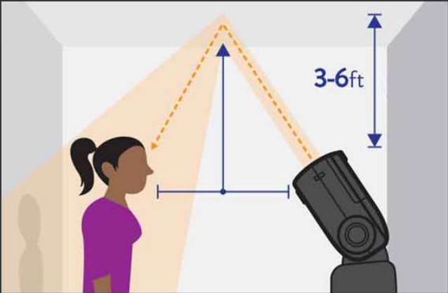

Cahaya yang keluar dari flash dipantulkan terlebih dahulu ke langit-langit,
baru menerpa obyek. Cara ini hanya akan berhasil di tempat yang mempunyai
langit-langit (untuk memantulkan cahaya yanag keluar dari flash). Teknik ini
digunakan untuk meratakan cahaya yang akan menerpa obyek. Cahaya muncul
seakan-akan dari atas obyek.

##### **b. Bounce Card**

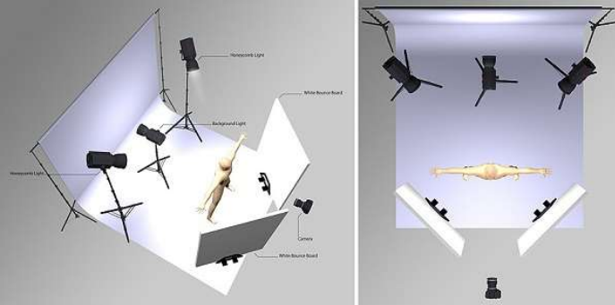

Cahaya yang keluar dari flash dibuat lebih soft, dengan cara menarik card
yang biasanya ada pada extemal flash. Card tersebut akan menahan cahaya agar
tidak menyebar keatas dan lebih mengarah kedepan. Biasanya external flash
juga menyediakan filter tambahan yang jika card tersebut ditarik maka filter
tersebut otomatis akan ikut keluar. Hal ini memperhalus jatuhnya cahaya
terhadap obyek.

##### **c. Slow Synchro**

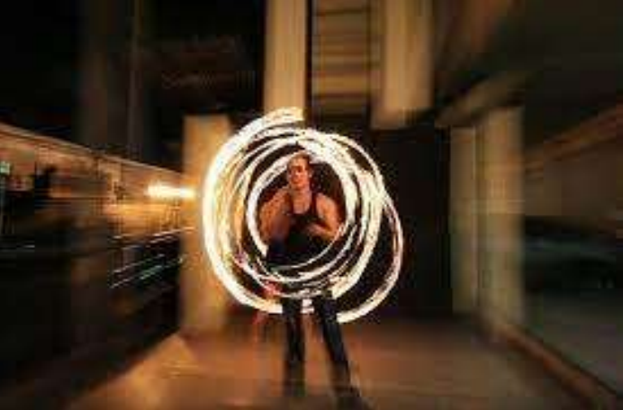

Kamera disetting dalam mode bulb, memungkinkan kamera 'menyerap'
cahaya sebanyak mungkin dalam waktu yang panjang. Slow synchro hanya bisa
dilakukan di tempat dengan penerangan minim. Dengan ini, fotografer bisa
membuat pola tertentu menggunakan penerangan kecil (senter, lampu mainan)
saat mode bulb aktif. Setelah selesai, nyalakan

##### **d. LED atau Light Emitting Diodes**

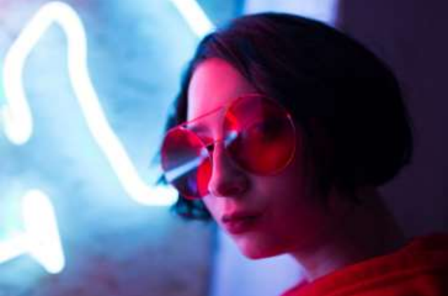

Cahaya LED masih terbilang baru dalam dunia fotografi namun
penggunaannya semakin umum. Biasanya ada ratusan lampu diode yang diatur
berkelompok dalam sebuah panel LED. Lampu semacam ini sangat stabil
temperatur warnanya. Tingkat terangnya bisa bervariasi tanpa harus mengganti
pengaturan white balance. Kualitas cahayanya keras objek perlu diperlembut
menggunakan diffusion atau dipantulkan melalui tembok. LED kurang terang
untuk foto yang menggunakan fast shutter speed, tapi bila objeknya tidak
bergerak dan bisa ditempatkan dekat sumber cahaya, maka LED cukup
memenuhi syarat.

##### **e. Flash dan Studio Strobe Cahaya strobe (atau flash)**

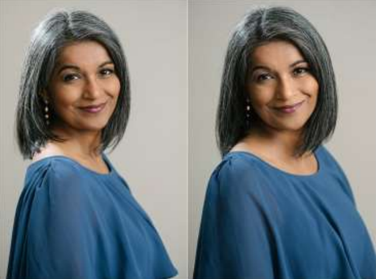

tidak seperti artificial light lain yang menyala terus menerus, melainkan
“ditembakkan” dalam waktu sepersekian detik bersamaan dengan ditekannya
tombol shutter. Karena itu pencahayaan ini agak sulit untuk divisualisasikan
tampilannya dalam foto yang akan diambil. Strobe lighting mungkin merupakan
artificial lighting yang paling umum digunakan dalam fotografi. 

##### **B. Arah Pencahayaan Fotografi**

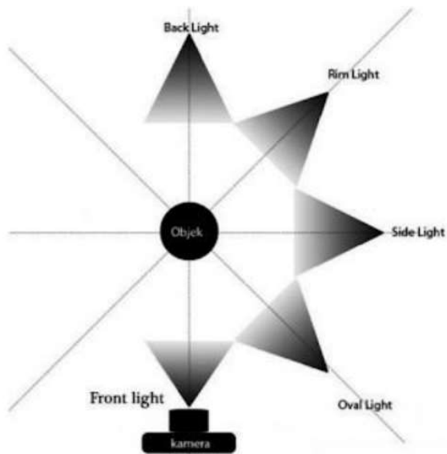

Arah pencahayaan dalam fotografi adalah salah satu aspek penting yang mempengaruhi
tampilan dan nuansa suatu gambar. Arah cahaya menentukan dari mana cahaya datang ke
subjek, dan pemilihan arah ini dapat mempengaruhi bayangan, sorotan, dan dimensi dalam
foto. Berikut adalah beberapa arah pencahayaan yang umum digunakan dalam fotografi:

##### *1. Front Light*

Front Light atau Pencahayaan dari arah depan menjadi salah satu cara yang bagus
untuk menghasilkan foto yang relatif tanpa bayangan sehingga tercipta efek yang
mengurangi tekstur dari benda yang kita foto. Sehingga objek yang kita foto tampak
flat atau datar serta halus.

##### *2. Rim Light*

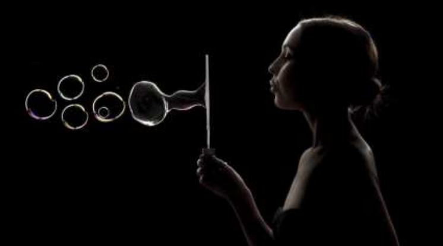

Teknik rim light dalam fotografi merupakan teknik pencahayaan (lighting) yang
memanfaatkan arah cahaya yang datang dari belakang objek dengan sudut 1/4 objek,
sehingga bagian depan objek akan tampak gelap. "rim" atau "halo" yang memisahkan
subjek dari latar belakang. Rim lighting dapat memberikan dimensi tambahan pada
subjek dan menciptakan efek yang dramatis.

##### *3. Back Light*

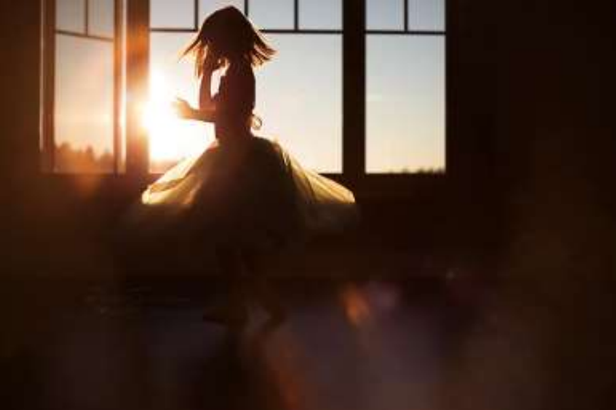

Teknik back light dalam fotografi merupakan teknik pencahayaan (lighting) yang
memanfaatkan arah cahaya yang datang tepat dari belakang objek yang dipotret.
Fotografer berhadapan langsung dengan arah datangnya cahaya (objek membelakangi
sumber cahaya). Teknik back light ini sering digunakan untuk memotret foto siluet.

##### *4. Side Light*

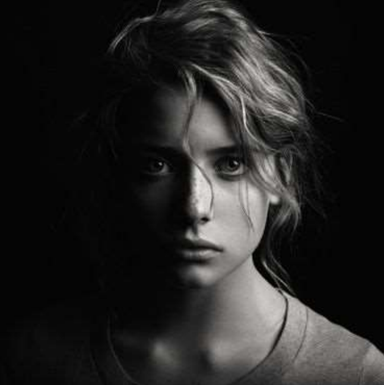

Pencahayaan dari samping atau side light menghasilan efek menonjolkan bentuk,
kontur, dan permukaan objek foto, dengan pencahayaan samping akan tercipta kesan
tiga dimensional dan objek foto terpisah dari latar belakang. Selain itu side light
memberikan kesan tersendiri seperti dramatis atau mencekam.

##### *5. Oval Light atau Rembrant Light*

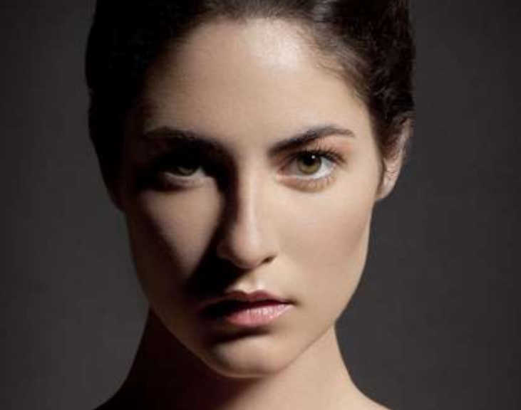

Teknik oval light dalam fotografi merupakan teknik pencahayaan yang memanfaatkan
arah cahaya yang datang dari sudut 45º dari posisi fotografer berada . Karakteristik dari
teknik oval light ini adalah untuk memunculkan dimensi pada objek tanpa kehilangan
karakter warna yang dimilikinya. Teknik ini banyak digunakan dalam studio dan
dikenal dengan nama rembrant light atau lip. Biasanya digunakan reflector untuk
membantu dalam memotret dengan teknik pencahayaan ini.

##### *6. Top light dan Butterfly Light*

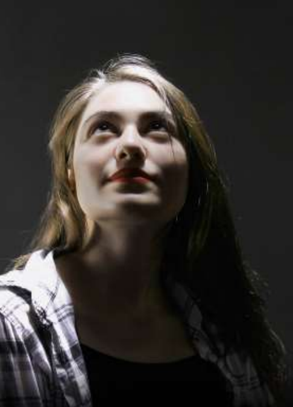

Teknik top light dalam fotografi merupakan teknik pencahayaan yang
memanfaatkan arah cahaya yang datang dari bagian atas objek yang dipotret, sehingga
memunculkan kilauan rambut atau hair light. Teknik top light ini digunakan untuk
membuat foto yang bagian atas objeknya memiliki kilauan sehingga menimbulkan
kesan yang sangat menarik serta mempertegas kontur objek. Baiasanya digunakan
untuk memotret foto butterfly light.
Butterfly light merupakan teknik yang digunkan untuk dunia kecantikan
seakan memberikan ekspektasi akan representasi kupu-kupu yang cantik, pencahayaan
kupu-kupu sangat melangsingkan wajah dan seringnya menciptakan efek wajah yang
kecil. Bayangan yang terbentuk di bawah kontur wajah yang menonjol (tulang pipi,
punggung alis dan rahang) untuk mengecilkan keluasannya.

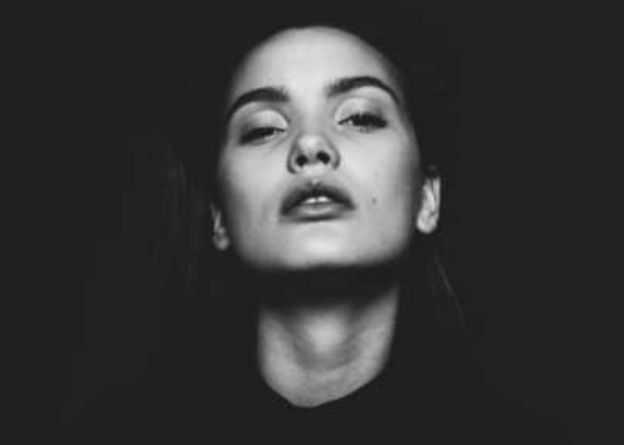

