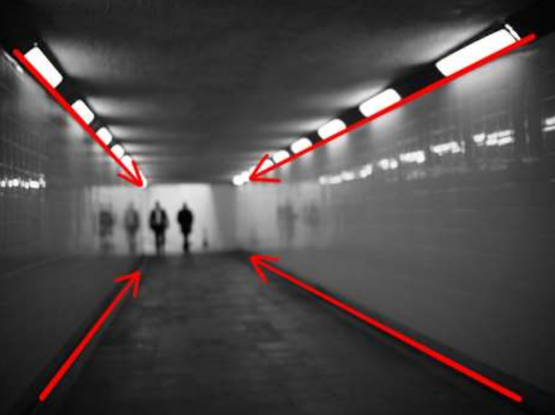

# **BAB 4**
## **KOMPOSISI FOTOGRAFI**
### **A. Pengertian Komposisi**

Komposisi merupakan penggunaan unsur-unsur yang ada dalam sebuah foto (bentuk,
nada, warna, pola dan tekstur, ruang) yang dimana agar foto terlihat bagus perlu ada
keseimbangan pada unsur-unsur tersebut. Tujuan adanya komposisi dalam dunia fotografi
yaitu mengorganisasikan berbagai komponen foto yang berbeda menjadi lebih seimbnag
dan harmoni sehingga gambar tersebut menjadi suatu kesatuan yang saling mengisi, serta
mendukung satu sama lainnya dan menghasilkan gambar yang berkualitas.

Penyusunan komposisi membutuhkan adanya suatu ruang tertentu yaitu Format. suatu
komposisi yang baik dan pas pada format tertentu belum tentu cocok atau sesuai dalam
format yang lainnya. Hla ini dikarenakan Setiap kamera memiliki ukuran dan bentuk format
yang berbeda-beda, tetapi secara garis besar hanya terdapat dua macam format yaitu persegi
(rectangle) dan bujur sangkar (square). Untuk memperoleh komposisi yang baik, dituntut
agar memiliki kepekaan tersendiri, yang dapat diperoleh melalui latihan-latihan
berkesinambungan secara tekun, serius dan intensif. Komposisi dalam fotografi
memerlukan batasan. Tanpa adanya pembatas yang jelas akan sulit untuk memahami ujung
pangkal sebuah komposisi.

Dengan pengaturan komposisi yang baik, foto yang dihasilkan akan semakin baik,
terutama bila mengingat fungsi foto itu sendiri sebagai media komunikasi visual sehingga
seorang peninjau atau penikmat fotografi dapat menangkap apa yang ingin disampaikan
sang fotografer melalui karyanya.

#### **B. Unsur Komposisi**

##### **1. Garis**

Garis merupakan unsur dari komposisi yang memiliki arah (naik, tegak, datar atau
menyilang) , Memiliki dimensi atau tanpa dimensi, bebas atau diatur, bersambung atau
terputus, melengkung atau melingkar. Garis memiliki fungsi sebagai unsur pembatas,
menjadi petunjuk yang memandu mata penikmat foto melalui seluruh komposisi,
menciptakan arah, pergerakan, dan struktur yang membentuk visual yang menarik. Ada
beberapa garis yang menjadi perhatian dalam melakukan pemotretan sebuah objek,
yaitu sebagai berikut.

• Garis Lurus: Dapat memberikan kesan kaku, tegang, sportif, ketelitian teratur
dan mapan, dan tegas

• Garis Melengkung : Memberikan kesan bebas, mengalir, keluwesan,
bergerak pelan, pasif, lembut, dan natural.

• Garis Zig-Zag : Menggambarkan perasaan kegelisahan, sentakan, tidak
teratur dan memberikan kesan bertentangan

• Garis Menyilang : Memberikan kesan Dinamis, perasaan bergerak,
menggambarkan mobilitas objek dengan baik

• Garis Horizontal : Menciptakan perasaan ketenangan dan keseimbangan
dalam gambar. Penggunaannya dapat efektif dalam fotografi landscape atau
pemandangan panorama.

• Garis Vertikal : Garis vertikal dapat menekankan ketinggian atau keberdirian
suatu objek serta bisa memberikan kesan kekuatan atau kestabilan.

##### **2. Tekstur**

Tekstur dapat ditangkap melalui indera penglihatan maupun indera peraba. Warna dan
tekstur saling berhubungan satu dengan lainnya. Tekstur dapat memberikan
penyampaian tentang sentuhan dan perasaan, memberikan kesan kedalaman gambar,
serta mempertegas permukaan suatu objek. alam tekstur hal yang perlu diperhatikan
adalah jatuhnya sinar terhadap benda tersebut. Penyinaran dapat memberikan kesan
datar dan kontras sehingga tekstur yang ada dalm sebuah gambar dapat tersampaikan
dengan baik.

##### **3. Warna**

Warna menjadi unsur yang penting dalam sebuah fotografi agar tercipta gambar yang
terlihat hidup. teori dan roda warna sudah digunakan pada semua aspek kehidupan,
seperti pada pakaian, desain, dan lain-lain, terutama fotografi. Warna dalam fotografi
digunakan untuk memperkuat daya tarik dan estetika visualnya. Warna dapat
memberikan kekuatan unsur yang sangat kuat di dalam fotografi. Dengan warna dapat
mempengaruhi besar kecilnya sebuah bentuk. Warna mengandung nilai, nada dan
corak. Warna dapat mempengaruhi emosi serta pengaruh latar belakang terhadap warna
yang dilihat. Warna dapat menipu pandangan karena warna dapat tampil pasif atau
menyolok, tampil ke depan atau belakang. Terdapat beberapa macam komposisi warna
yang dapat digunakan dalam fotografi, yaitu sebagai berikut.

##### **a. Warna Komplementer**

Salah satu harmoni warna yang paling banyak digunakan adalah kombinasi
warna komplementer. Dalam spektrum warna, warna-warna komplementer
ditentukan dari warna yang saling berlawanan satu sama lain. Sebagai
contoh, hijau dan merah, ungu dan kuning. Kombinasi warna ini
memunculkan kontras dari nada warna yang hangat dan sejuk serta sering
digunakan untuk memperlihatkan titik fokal atau untuk menambahkan daya
tarik/tegangan terhadap foto. Karena hanya memerlukan dua warna saja,
kombinasi ini sangat mudah dipakai untuk menghasilkan ambilan foto yang
dinamis.

##### **b. Warna Analog**

Warna analog memiliki kontras warna yang cukup halus, sehingga hasil
warna yang dihasilkan memberikan ketenangan karena tidak terlalu
mencolok. Hal ini karena transisi yang mulus dari tiga warna yang saling
berdampingan dalam roda warna seperti selayaknya dikenali mata manusia..
Warna-warna analog bukanlah warna yang paling mudah didapatkan dan
seringnya membutuhkan sedikit perbaikan pasca-produksi untuk mencapai
efek yang diharapkan.

##### **c. Warna Triad**

Warna triad adalah salah satu komposisi warna yang melibatkan tiga warna
utama yang ditempatkan secara strategis satu sama lain di roda warna. Warna
pertama adalah warna primer (merah, kuning, biru), Kedua adalah warna
sekunder (jingga, ungu, hijau), dan yang terakhir adalah warna campuran dari 3
warna tersebut. Warna-warna ini dipilih sedemikian rupa sehingga membentuk
segitiga di roda warna. Triad ini menciptakan kombinasi warna yang kontras
dan seimbang.

##### **d. Warna Split Koplementer**

Warna-warna split komplementer, atau harmoni campuran, menggunakan dua
warna yang bergantian ditambah dengan satu warna tambahan yang berlawanan
dengan warna yang diloncatinya (mengacu pada diagram di atas). Melalui
ketidakseimbangan rasio warna 2:1. Perubahan kecil ini menghasilkan kontras
visual yang lebih kuat.

##### **C. Macam-Macam Komposisi**

##### *1. Rules Of Third*
   

Rules of Third atau aturan seperti merupakan salah satu komposisi yang banyak
digunakan dalam dunia fotografi. Dalil ini menjelaskan bahwa Penempatan objek
utama dalam gambar sangat penting untuk mendapatkan komposisi yang baik. Objek
dapat ditempatkan di pusat gambar, tetapi pada umumnya komposisi yang lebih
menarik dihasilkan jika subyek utama ditempatkan tidak dipusat gambar. Dalil 1/3
bagian sering digunakan untuk penempatan subyek utama. Bagilah bidang gambar
menjadi 1/3 bagian sama besar secara horizontal dan vertikal dengan menarik masingmasing dua garis horizontal dan vertikal. Posisi ini akan memberikan kesan ruang yang
menampilkan objek dengan latar yang begitu seimbang sehingga terlihat harmonis.

##### *2. Arah Gerak pandang*
   

Arah Gerakan pandang atau Leading Lines atau Garis Pemandu, adalah komposisi yang
digunakan untuk menuntun mata penikmat foto kepada suatu objek tertentu. Hal ini
dilakukan agar setiap hasil gambar memiliki sebuah makna dan penikmatinya dapat
menikmatinya secara menyeluruh. Komposisi ini menggunakan garis dalam suatu
gambar untuk mengarahkan pandangan penonton menuju subjek utama. Penggunaan
garis-garis ini dapat menciptakan aliran visual, memberikan dinamika, dan memberikan
kedalaman pada komposisi. Berikut adalah penjelasan lebih detail:

5. Komposisi Center of Interest
   

Komposisi Center of interest atau pusat perhatian adalah komposisi yang menempatkan
objek pada posisi yang seimbang visual. keseimbangan formal dihasilkan jika objek
dengan ukuran/berat visual sama ditempatkan disetiap sisi gambar atau objek utama
berada di pusat gambar. Namun, dalam fotografi sering kali digunakan keseimbangan
nonformal untuk mendapatkan keseimbangan visual. Misalnya, digunakan dua objek
yang lebih kecil untuk mengimbangi sebuah objek yang besar. Bidang gelap di tepi
bawah bingkai dan bayangan dapat memberikan kesan kestabilan.

REFERENSI
Yunianto, I. (2021). TEKNIK FOTOGRAFI, Belajar Daris Basic Hingga
Professional. Penerbit Yayasan Prima Agus Teknik, 1-88
MUNG, M. P., & Sos, S. MODUL FOTOGRAFI DASAR.
https://www.academia.edu/16533390/Artificial_Light_cahaya_buatan_dalam_fotografi_
file:///C:/laragon/www/Latihan/css/css%203/image/Modul-Fotografi-Dasar-PROBIS-UM.pdf
https://staffnew.uny.ac.id/upload/132319839/pendidikan/Komposisi+Dalam+Fotografi+FOT
OGRAFI+2.pdf
Herlina, Y. (2007). Komposisi Dalam Seni Fotografi. Nirmana, 9(2), 82-88.
