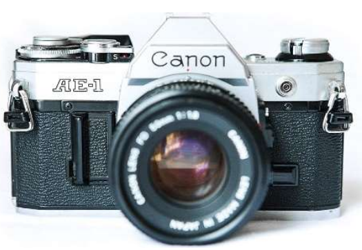

# BAB 1
## PENGANTAR FOTOGRAFI
### A. Pengertian Fotografi
Fotografi (dari bahasa Inggris: photography, yang berasal dari kata Yunani yaitu
"photos": cahaya dan "grafo": melukis/menulis), sehingga dapat di artikan bahwa Fotografi
adalah proses melukis/menulis dengan menggunakan media cahaya. Sebagai istilah umum,
fotografi berarti Suatu metode dalam menghasilkan suatu gambar atau foto dari objek
dengan menangkap pantulan cahaya yang mengenai objek tersebut pada media yang peka
terhadap cahaya.

Elliott Erwitt, (seorang fotografer Dokumenter Asal Amerika Serikat), berpendapat
bahwa fotografi itu adalah seni observasi atau seni mengamati hal-hal yang menyenangkan
di tempat-tempat yang biasa kita temui. Ansel Adams (fotografer Amerika Serikat dan
seorang aktivis lingkungan), berpendapat bahwa fotografi adalah media komunikasi serta
media untuk berekspresi. Fotografi menawarkan banyak persepsi, eksekusi serta
interpretasi yang tanpa batas. Selain itu, menurut fotografer terkenal indonesia, Yudhi
Soerjoatmodjo, fotografi adalah alat untuk berdialog serta media komunikasi. Fotografi
bisa ditilik dengan kacamata dokumentasi, informasi dan tentu saja, seni.
Dari beberapa pendapat para ahli di atas, kita bisa mengambil jalan tengah. Bahwa
fotografi adalah aktivitas mengabadikan suatu moment/kenyataan melalui perangkat
kamera, yang hasilnya bisa dimaknai dan dinikmati oleh manusia yang lain. Dalam
Fotografi terdapat banyak aliran antara lain fotografi pemandangan atau landscape,
humanis, fotografi model, fotografi makro dan masih banyak lagi yang lainnya.

### B. Tujuan Fotografi
Tujuan Utama dari Fotografi adalah “komunikasi”. Melakukan fotografi akan tercipta
sebuah gambar yang menampillkan beberapa objek di dalamnya. Dari objek itulah
tersampaikan pesan atau merupakan ide yang terekspektasikan kepada pemirsanya
sehingga terjalin suatu kontak pemahaman makna.

### C. Aspek Fotografi
Menangkap suatu gambar dalam fotografi merupakan hal yang cukup kompleks. Untuk
mendapatkan sebuah gambar yang baik, tidak hanya menekankan pada permainan
komposisi dan teknis pemotretan, tetapi juga, dasar fotografi yang digunakan menjadi
sebuah pertimbangan yang perlu dimatangkan. Dasar fotografi ini lebih berorientasi pada
unsur yang memudahan kegiatan fotografi agar gambar yang dihasilkan sesuai dengan
konsep. Ada empat unsur penting sebagai dasar fotografi, yaitu :
1. Pencahayaan
Sumber Pencahayaan yang digunakan dalam dunia fotografi yaitu ada Cahaya Alam
atau Natural Light. Cahaya alam merupakan cahaya yang di dapatkan tanpa bantuan
alat dan datang secara alami dari alam. Terdapat beberapa cahaya alam, seperti
matahari, bulan, bintang, dan lain-lain. Kemudia cahaya buatan atau Flash Light.
Cahaya Buatan merupakan cahaya yang dibuat dengan bantuan peralatan modern untuk
menghasilkan pencahayaan di tempat sulit cahaya. Cahaya Buatan biasa berasal dari
senter, blitz, lampu studio dan lain-lain.
2. Efek Gerak
Dengan efek gerak sebuah karya fotografi menjadi seolah-olah ’hidup’. Gerak dalam
fotografi ada gerakan lambat (show action), gerakan yang mengikuti objek (panning)
dan gerakan yang cepat sehingga objek terbekukan (stop action). Efek Gerak
dipengaruhi oleh seberapa kamera dapat menangkap sebuah gambar atau biasa disebut
dengan Shutter Speed.
3. Fokus dan Ruang Tajam
Fokus dapat menampilkan gambar yang penting lebih optimal. Melalui fokus akan
terlihat apa yang menjadi pokok pembicaraan dalam sebuah foto. Dengan fokus dapat
memberikan kesan kedalaman pada sebuah foto dengan membuat efek blur pada latar
depan atau pada latar belakang. Dengan mengatur kedalaman ruang dapat membantu
pembentukan dimensi gambar. Dengan fokus yang baik dan tepat maka kita dapat
mengatur ketajaman gambar, subjek bisa tampil menarik dan ekspresi serta informasi
gambar dapat disampaikan dengan ’sempurna’. Hal ini dapat dipengaruhi oleh Apeture
dan DOF dari sebuah kamera
4. Komposisi
komposisi dapat mendukung ekspresi dan keindahan susunan bentuk-bentuk dalam
sebuah foto. Komposisi dalam fotografi diantaranya adalah warna, bentuk, bidang,
tekstur, sudut pandang, format, irama, keseimbangan proporsi dll. Melalui komposisi
yang tepat maka sebuah foto tidak menjadi datar (flat) tetapi menjadi sebuah foto yang
berdimensi. Komposisi merupakan jalan termudah untuk mempertajam kemampuan
dalam fotografi. Pada saat melakukan pemotretan dengan pengaturan komposisi yang
baik, foto yang kita buat akan semakin baik.

### D. Kamera
#### 1. Pengertian Kamera
Kamera merupakan seperangkat perlengkapan elektronik yang diperuntukan
mengabadikan suatu momen ataupun objek menjadi sebuah gambar, baik yang tercetak
maupun digital. Gambar ini dihasilkan melalui proyeksi yang terdapat pada sistem lensa
kamera. Kamera bekerja dengan cara memanfaatkan cahaya yang ada di sekitarnya
sebuah objek, seperti cahaya matahari atau cahaya buatan (Lampu), sehingga lensa
dapat menunjukkan bentuk jelas dari sebuah objek yang ditangkap.
#### 2. Jenis Kamera

a. Kamera Analog

Kamera Analog merupakan kamera yang menggunakan film negatif sebagai
media penyimpanan gambar. Selain itu, kamera analog di desain untuk hanya
menghasilkan gambar dari pita film dan tidak menghasilkan gambar digital
(Dapat dilakukan dengan rangkaian proses tertentu). Analog adalah sebuah
sinyal ditangkap dari luar dan di proses secara keseluruhan untuk mendapatkan
hasil terbaik. 

